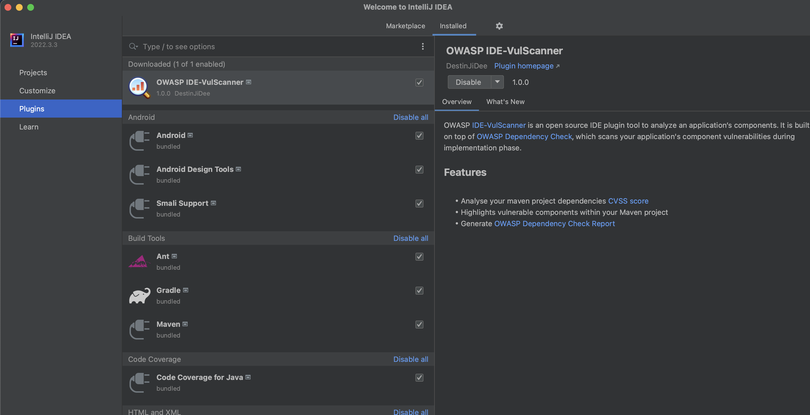

# OWASP IDE-VulScanner  

## OWASP IDE-VulScanner  

  
OWASP IDE-VulScanner is an open-source IDE plugin tool designed to analyze an application's components. It is built on top of [OWASP Dependency Check](https://owasp.org/www-project-dependency-check/), which scans your application's component dependencies for vulnerabilities during the implementation phase.  

## Features  
- Detects vulnerabilities in code during development.  
- Helps maintain security patches and reduce maintenance costs.  
- Identifies both high and critical-level vulnerabilities with minimal effort.  

## Preview  
  
[Video Guide](https://www.youtube.com/watch?v=T2tPfmX94Qc) *(Open in New Tab)*  

## Installation  

### Using the Built-in Plugin System:  
1. Go to **Settings/Preferences** → **Plugins/Marketplace**  
2. Search for **"OWASP IDE-VulScanner"**  
3. Click **Install Plugin**  

### Manual Installation:  
1. Download the [latest release](https://plugins.jetbrains.com/plugin/21353-owasp-ide-vulscanner/versions)  
2. Open **Settings/Preferences** → **Plugins**  
3. Click **⚙️ (gear icon) → Install plugin from disk...**  

## Contribute  
If you have experience in building plugins or extensions, you can contribute to the following:  
- **Eclipse**  
- **VSCode**  
- **IntelliJ**  

For any queries or contributions, feel free to reach out at **"jitu.ranjan@owasp.org"**. We would love to collaborate and enhance this open-source security tool!  
